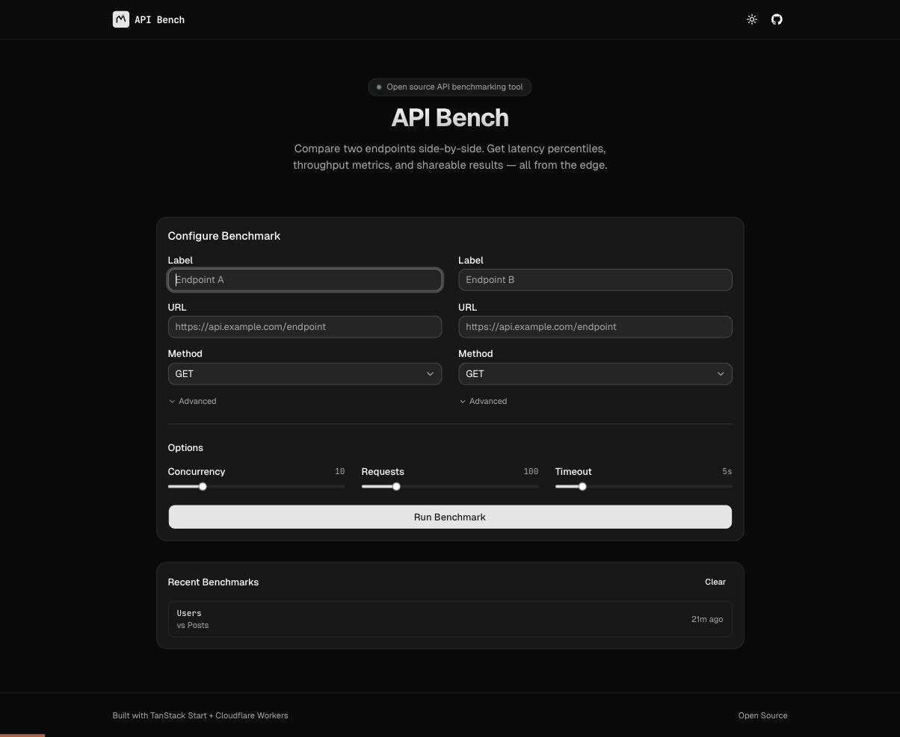

# API Bench

> **[bench.devglory.dev](https://bench.devglory.dev)** — Try it live

Compare two API endpoints side-by-side. Get latency percentiles, throughput metrics, and shareable results in seconds.

<p align="center">
  
</p>

## Features

- **Side-by-side benchmarking** — run configurable concurrent requests against two endpoints
- **Real-time progress** — live SSE streaming with progress bars and running averages
- **Detailed stats** — avg, p50, p95, p99 latency, throughput (req/s), status codes, error rate
- **Winner indicators** — green/red highlighting shows which endpoint is faster per metric
- **Shareable results** — save benchmarks to Cloudflare D1 and share via URL
- **SSR-first** — results pages are server-rendered for instant load and social sharing

## Tech Stack

- [TanStack Start](https://tanstack.com/start) v1 — React 19 meta-framework with SSR
- [TanStack Router](https://tanstack.com/router) — file-based routing
- [TanStack Query](https://tanstack.com/query) — server state management
- [Cloudflare Workers](https://developers.cloudflare.com/workers/) — edge deployment
- [Cloudflare D1](https://developers.cloudflare.com/d1/) — SQLite database for result persistence
- [Drizzle ORM](https://orm.drizzle.team/) — type-safe database access
- [Tailwind CSS](https://tailwindcss.com/) v4 + [shadcn/ui](https://ui.shadcn.com/) — styling
- [Biome](https://biomejs.dev/) — linting and formatting
- [Zod](https://zod.dev/) — runtime validation

## Getting Started

### Prerequisites

- [Node.js](https://nodejs.org/) >= 22
- [pnpm](https://pnpm.io/) >= 10

### Install

```bash
git clone https://github.com/SvetoslavHalachev/api-bench.git
cd api-bench
pnpm install
```

### Configure Wrangler

Create a `wrangler.jsonc` in the project root:

```jsonc
{
  "$schema": "node_modules/wrangler/config-schema.json",
  "name": "api-bench",
  "compatibility_date": "2025-09-02",
  "compatibility_flags": ["nodejs_compat"],
  "main": "@tanstack/react-start/server-entry",
  "d1_databases": [
    {
      "binding": "DB",
      "database_name": "api-bench",
      "database_id": "YOUR_D1_DATABASE_ID",
      "migrations_dir": "drizzle/migrations"
    }
  ]
}
```

### Local Development

```bash
# Apply D1 migrations locally
npx wrangler d1 migrations apply api-bench --local

# Start dev server
pnpm dev
```

### Deploy to Cloudflare

```bash
# Login to Cloudflare
npx wrangler login

# Create a D1 database
npx wrangler d1 create api-bench
# Copy the database_id into your wrangler.jsonc

# Apply migrations to remote D1
npx wrangler d1 migrations apply api-bench --remote

# Deploy
pnpm deploy
```

## Scripts

| Command | Description |
|---------|-------------|
| `pnpm dev` | Start development server |
| `pnpm build` | Production build |
| `pnpm preview` | Preview with local Wrangler |
| `pnpm deploy` | Deploy to Cloudflare Workers |
| `pnpm lint` | Run Biome linter |
| `pnpm lint:fix` | Fix lint issues |
| `pnpm type-check` | TypeScript type checking |

## How It Works

1. Enter two API endpoint URLs with optional configuration (method, headers, body)
2. Set benchmark options: concurrency (1-50), request count (10-500), timeout (1-30s)
3. The engine runs requests sequentially per endpoint (A then B) to avoid interference
4. Progress streams via Server-Sent Events in real-time
5. Results show side-by-side comparison with latency percentiles and throughput
6. Save and share results via a unique URL backed by Cloudflare D1

## License

MIT
